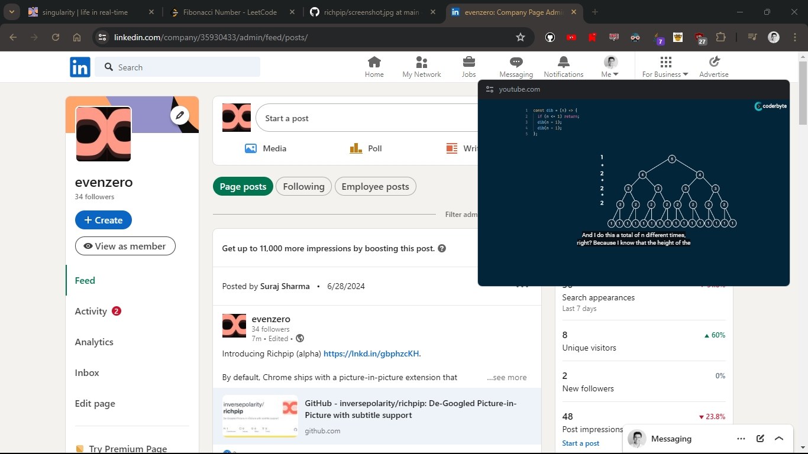

# Richpip - De-Googled Picture-in-Picture Chrome Extension (with subtitle support)

By default, Chrome ships with a picture-in-picture extension that 

- collects data on videos watched
- provides no subtitle support

RichPip aims to fix these.

## Configuration

The keyboard shortcut (defaults to `Alt-P`) 
